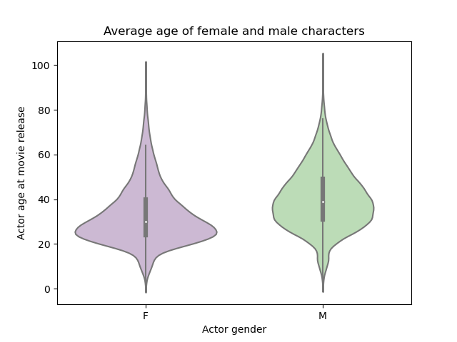
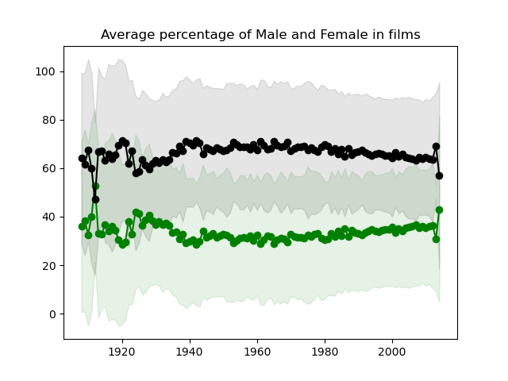
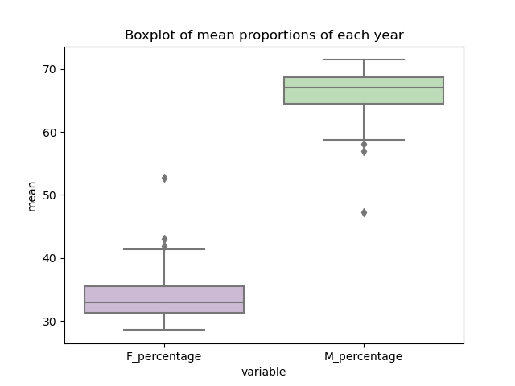

# Unveiling the Balance in Gender Representation in the Movie Industry

# Abstract
_(A 150 word description of the project idea and goals. What’s the motivation behind your project? What story would you like to tell, and why?)_

# Introduction
Films play an important role in perpetuating ideas and stereotypes, and gender is no exception. Traditionally, female characters have been portrayed in the roles of mothers, wife, girlfriend, or sex object motifs while male actors have dominated the leading roles. With the rise of feminism in the 1960s, 1990s, and more recently in the 2010's especially with the rise of movements such as the MeToo movement, we must ask whether improvements have been made in the balance of gender representation in the Film Industry. We attempt to examine the disparity between the representation of male and female characters using the CMU Film Synopsis Corpus. In addition, we will investigate the male-female distribution not only for the actors but also for the film crew in order to reveal the balance in gender representation in the Movie Industry.

During the analysis, we utilized a variety of chart types to improve the depth of interpretation. These are the same samples from our initial analysis:

  
   
  

You can find all of the charts in the output file. 

# Research Questions:

The project includes research questions from two domains : Stationary Analysis & Time Series Analysis

Stationary Analysis

Questions:

1) How does the gender composition of cast and crew correlate with a film's success, measured in terms of box office revenue and award recognitions?
2) Are there specific movie genres that demonstrate a minimal or no gender gap in terms of character representation?
Does the balance of male and female characters impact a film's financial success?
3) What is the gender representation trend in the most popular movie genres?
4) Do films that pass the Bechdel test perform differently at the box office compared to those that don't?
5) How does gender representation in award-winning films compare to those that did not win major awards?
6) How does gender representation in the film industry vary across different countries?
7) What are the character types that are portrayed by uniquely female actresses and male actors? How are the character descriptions sentiments differing with respect to the gender? Is it the same for unisex characters that can be portrayed by both genders?

Time Series Analysis

Questions:

1) How has the gender balance among cast and crew evolved over the years in the film industry?
2) In the Oscars, how does gender representation among nominees and winners vary over time?
3) What are the long-term trends in gender representation in movies?

Adam: Character complexity by defining some metric, for example number of actions a character takes in the movie plot summary. Problems are some plot descriptions are only a sentence. Looking at the type of actions with CoreNLP, extract the sentences associated by the characters, extract adjectives.

Somehow analyse the changes in characters and assign a score of character complexity to each character -> analyse the complexity across female and male characters.

# Proposed additional datasets (if any):
We have already used CMU Movie Dataset with Stanford CoreNLP-processed summaries. In addition to that, we plan to use three additional datasets to enrich our research results.

1) Data collected by us: We collected additional data by following the below steps:
    * Dataset creation using Freebase IDs and Wikidata API to extract IMDb IDs.
    * Utilization of the TMDB API for acquiring gender information of cast and crew members.

    The results are stored in movie_with_gender_info.csv file.

2) Oscar award dataset: 

    To analyse Oscar awards data by gender, focusing on nominee and winner gender proportions, revealing industry gender biases and progress towards equality in film awards, we plan to use the following dataset:

    The data is taken from https://www.kaggle.com/datasets/unanimad/the-oscar-award/data?select=the_oscar_award.csv.

3) Bechdel test : A measure to assess the representation of women in films

    The test involves three criteria:

    1) Two Women: The movie must have at least two women in it.
    2) Who Talk to Each Other: These women must talk to each other at some point.
    3) About Something Besides a Man: Their conversation must be about something other than a man.

    The data is taken from https://www.kaggle.com/datasets/alisonyao/movie-bechdel-test-scores.

# Methods

Step 1: Data scraping, pre-processing and dataset construction

Step 2: Create and visualize

Step 3: Determine the character importance based on the CoreNLP summaries

Character complexity by defining some metric, for example number of actions a character takes in the movie plot summary. Problems are some plot descriptions are only a sentence. Looking at the type of actions with CoreNLP, extract the sentences associated by the characters, extract adjectives.

Somehow analyse the changes in characters and assign a score of character complexity to each character -> analyse the complexity across female and male characters.

Step 7: Provide detailed analysis for each research question
Step 8: Create data story
# Proposed timeline

# Organization within the team:
_(A list of internal milestones up until project Milestone P3.)_

# References

[1] [Learning Latent Personas of Film Characters](http://www.cs.cmu.edu/~dbamman/pubs/pdf/bamman+oconnor+smith.acl13.pdf)
David Bamman, Brendan O'Connor, and Noah A. Smith
ACL 2013, Sofia, Bulgaria, August 2013
